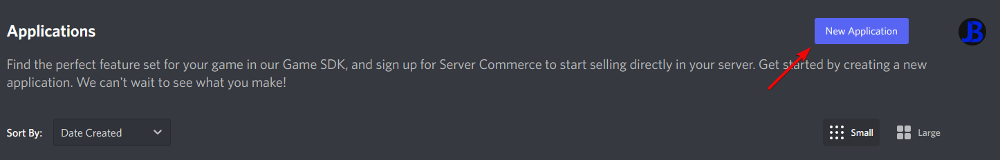
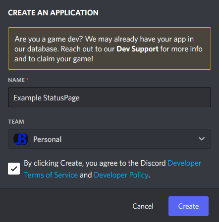
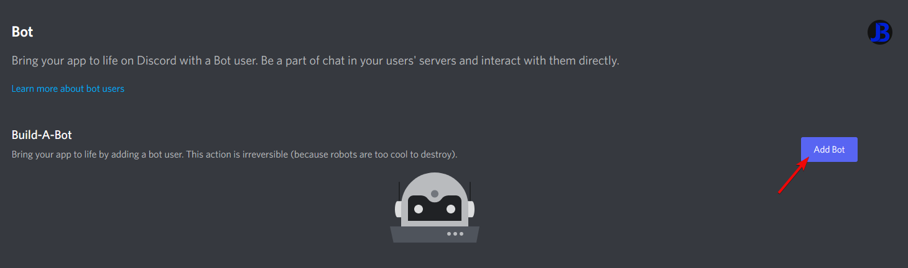
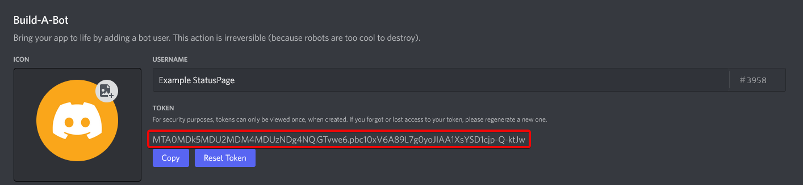
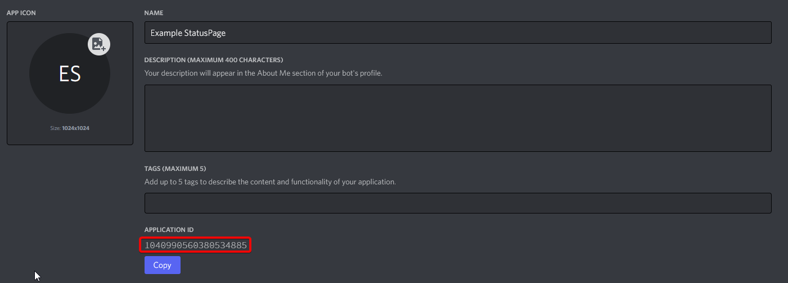

A simple discord bot and webpage to give **you** control in letting your users know when your services are down.

## Contents

- [Contents](#contents)
- [Installation](#installation)
  - [Native installation](#native-installation)
  - [Docker installation](#docker-installation)
- [Configuration](#configuration)

## Installation

StatusPage is a simple node application which uses Express.JS for its homepage and API, and Discord.JS for its discord integration.

You can install it natively or in a docker container.

### Native installation

This guide will use Ubuntu 20.04 but it should work on most OSes with minor differences such as paths.

1. Clone this repository

    ```console
    git clone https://github.com/JackBailey/StatusPage
    ```

2. Enter the StatusPage Directory

    ```console
    cd StatusPage
    ```

3. Install the required packages

    I recommend yarn for this but you can use npm if you'd prefer.

    Requirements:

    - [Node](https://www.digitalocean.com/community/tutorials/how-to-install-node-js-on-ubuntu-20-04)
    - [Yarn](https://www.digitalocean.com/community/tutorials/js-yarn-package-manager-quick-intro)

    <br>

    ```console
    yarn install
    ```

4. [Edit the configuration files](#configuration)

5. Start the application
    ```console
    yarn start
    ```
6. Run it in the background If you'd like to be able to close your terminal and keep it running you can use [forever](https://npmjs.com/package/forever)

    Install forever

    ```console
    npm install -g forever
    ```

    Start StatusPage with forever

    ```console
    forever start index.js
    ```

### Docker installation

This is my preferred method due to its ease of use and control.

1. Install Docker and Docker compose

    ```console
    curl -fsSL https://get.docker.com -o get-docker.sh
    sh get-docker.sh
    ```

2. Clone this repository

    ```console
    git clone https://github.com/JackBailey/StatusPage
    ```

3. Enter the StatusPage Directory

    ```console
    cd StatusPage
    ```

4. [Edit the configuration files](#configuration)

5. Start the container detached

    ```console
    docker compose up -d
    ```

6. Check the logs of the container to check it started correctly

    ```console
    docker logs --follow StatusPage
    ```

    It should show both `Express.JS: Listening on port XXXXX` and `Discord: Logged in as XXXXX#1234`

## Configuration

1. Copy the example files

    Once you have cloned and entered repository run the following commands to create configuration files you can edit

    ```console
    cp .env.example .env
    cp config.example.json config.json
    cp services.example.json services.json
    ```

2. Create a Discord Application

    Go to [Discord Developer Applications](https://discord.com/developers/applications/) and create a new application

    

    Set your application's name and agree to the Terms of Service.

    

3. Create the bot

    Go to the bot tab and click `Add Bot`

    

    And say `Yes, do it!` to the popup that comes up

4. Get the required bot information

    Reset the bot's token and make a note of the resulting token (Keep this to yourself and don't share it with anyone)

    

    Go back to the General Information tab and make a note of the Application ID

    

5. Add the bot to your discord server

    Go to the following link where `APPLICATION_ID` is the application ID you copied earlier

    `https://discord.com/api/oauth2/authorize?client_id=APPLICATION_ID&permissions=2147483648&scope=bot`

    Then add it to whatever server you want the bot in.

6. Edit the configuration files

    #### **app.env**

    Replace `YourDiscordBotToken` with the token you copied earlier, it'll look like `MTA0MDk5MDU2MDM4MDUzNDg4NQ.GTvwe6.pbc10xV6A89L7g0yoJIAA1XsYSD1cjp-Q-ktJw`

    #### **config.json**

    Set this to whatever you like, just make sure that you set the discord.statusChannel.id to the channel you want, leave the lastMessage as default - It'll send a new one and change it for you

    Set authorizedRoles to the role ids you want to let change the status with slash commands

    Set the client_id to the application ID you copied earlier

    Set the guild_id to the discord server ID you've added the bot to

    Edit the rest to your liking

    #### **services.json**

    Edit this to whatever you like - Just make sure at least one has `default: true` that the bot can set services to after a `/status reset`
